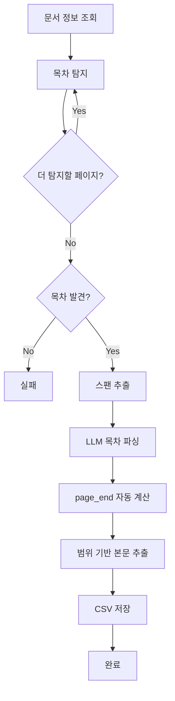

# 개발 가이드

## 🚀 빠른 시작

### 1. 환경 설정

```bash
# 환경변수 파일 생성
cp .env.example .env

# .env 파일 편집
# OPENAI_API_KEY=your_openai_api_key_here
# GPT5_MODEL=gpt-5-mini
```

### 2. 백엔드 실행

```bash
# 의존성 설치
pip install -r requirements.txt

# 또는 Poetry 사용
poetry install

# 백엔드 서버 시작
python scripts/start-backend.py

# 또는 직접 실행
cd backend && python -m uvicorn main:app --reload --host 0.0.0.0 --port 8000
```

### 3. 프론트엔드 실행

```bash
# 프론트엔드 디렉토리로 이동
cd frontend

# 의존성 설치
npm install

# 개발 서버 시작
npm run dev

# 또는 스크립트 사용
node ../scripts/start-frontend.js
```

### 4. 접속

- **프론트엔드**: http://localhost:3000
- **백엔드 API**: http://localhost:8000
- **API 문서**: http://localhost:8000/docs

## 🏗️ 아키텍처

### 백엔드 (Python + FastAPI + LangGraph)

```
backend/
├── main.py                 # FastAPI 메인 애플리케이션
├── config.py              # 설정 관리
├── api/                   # API 엔드포인트
│   ├── parsing.py         # PDF 파싱 관련 API
│   ├── documents.py       # 문서 관리 API
│   └── system.py          # 시스템 관리 API
├── langgraph/             # LangGraph 파이프라인
│   ├── graph.py           # 파이프라인 구성
│   └── nodes.py           # 노드 구현
├── clients/               # 외부 서비스 클라이언트
│   ├── openai_client.py   # GPT-5 전용 클라이언트
│   └── mcp_client.py      # MCP 클라이언트
├── models/                # 데이터 모델
│   ├── state.py           # LangGraph 상태
│   └── schemas.py         # API 스키마
└── prompts/               # AI 프롬프트
    └── insurance_prompts.py
```

### 프론트엔드 (React + TypeScript + Vite)

```
frontend/
├── src/
│   ├── main.tsx           # 애플리케이션 엔트리
│   ├── App.tsx            # 메인 앱 컴포넌트
│   ├── components/        # 재사용 컴포넌트
│   │   └── Layout.tsx     # 레이아웃 컴포넌트
│   ├── pages/             # 페이지 컴포넌트
│   │   ├── Dashboard.tsx  # 대시보드
│   │   ├── DocumentList.tsx
│   │   ├── DocumentDetail.tsx
│   │   ├── ParseResult.tsx
│   │   └── SystemStatus.tsx
│   ├── lib/               # 유틸리티
│   │   └── api.ts         # API 클라이언트
│   └── index.css          # 글로벌 스타일
├── package.json
├── vite.config.ts
└── tailwind.config.js
```

## 🔧 주요 기능

### 1. PDF 파싱 파이프라인 (LangGraph)



### 2. GPT-5 전용 AI 파싱

- **허용 모델**: `gpt-5`, `gpt-5-mini`만 사용
- **스팬 레벨 처리**: PyMuPDF의 세밀한 텍스트 분석
- **자동 계산**: page_end 자동 계산
- **구조화**: 보험약관 표준 구조 인식

### 3. 실시간 진행 상태

- **WebSocket**: 실시간 파싱 진행 상태
- **SSE**: Server-Sent Events로 로그 스트리밍
- **진행률**: 단계별 진행률 표시

## 🧪 테스트

### 백엔드 테스트

```bash
# 단위 테스트
pytest tests/

# 커버리지 포함
pytest --cov=backend --cov-report=html

# API 테스트
pytest tests/api/
```

### 프론트엔드 테스트

```bash
cd frontend

# 단위 테스트
npm test

# E2E 테스트
npm run test:e2e
```

## 🐳 Docker 실행

### 개발 환경

```bash
# 전체 서비스 시작
docker-compose up -d

# 로그 확인
docker-compose logs -f

# 서비스 종료
docker-compose down
```

### 프로덕션 환경

```bash
# 프로덕션 프로파일 사용
docker-compose --profile production up -d
```

## 🔍 디버깅

### 백엔드 디버깅

```bash
# 로그 레벨 변경
export LOG_LEVEL=DEBUG

# 디버그 모드 실행
python -m uvicorn backend.main:app --reload --log-level debug
```

### 프론트엔드 디버깅

```bash
# 개발자 도구에서 네트워크 탭 확인
# React DevTools 사용
# Vite 개발 서버의 HMR 활용
```

## 📊 모니터링

### 메트릭

- **파싱 성공률**: 완료/실패 통계
- **처리 시간**: 평균 파싱 시간
- **시스템 리소스**: CPU/메모리 사용량
- **API 응답 시간**: 엔드포인트별 성능

### 로그

```bash
# 애플리케이션 로그
tail -f app.log

# 시스템 로그 (Docker)
docker-compose logs -f backend

# Nginx 로그 (프로덕션)
docker-compose logs -f nginx
```

## 🚨 문제 해결

### 일반적인 문제

1. **OpenAI API 키 오류**
   ```bash
   # .env 파일에 올바른 키 설정 확인
   cat .env | grep OPENAI_API_KEY
   ```

2. **MCP 서버 연결 실패**
   ```bash
   # MCP 서버 상태 확인
   curl http://localhost:8001/health
   ```

3. **의존성 설치 실패**
   ```bash
   # Python 가상환경 확인
   which python
   pip --version
   
   # Node.js 버전 확인
   node --version
   npm --version
   ```

4. **포트 충돌**
   ```bash
   # 사용 중인 포트 확인
   lsof -i :8000  # 백엔드
   lsof -i :3000  # 프론트엔드
   ```

### 성능 최적화

1. **백엔드 최적화**
   - 비동기 처리 활용
   - 캐싱 구현 (Redis)
   - 데이터베이스 인덱싱

2. **프론트엔드 최적화**
   - 코드 스플리팅
   - 이미지 최적화
   - 번들 크기 최소화

## 📚 추가 자료

- [FastAPI 문서](https://fastapi.tiangolo.com/)
- [LangGraph 가이드](https://langchain-ai.github.io/langgraph/)
- [React 문서](https://react.dev/)
- [Tailwind CSS](https://tailwindcss.com/)
- [Vite 가이드](https://vitejs.dev/)

## 🤝 기여 가이드

1. **이슈 생성**: 버그 리포트 또는 기능 요청
2. **브랜치 생성**: `feature/새기능` 또는 `fix/버그수정`
3. **코드 작성**: 기존 코딩 스타일 준수
4. **테스트 작성**: 새 기능에 대한 테스트 추가
5. **PR 생성**: 명확한 설명과 함께 Pull Request

## 📝 라이선스

MIT License - 자세한 내용은 LICENSE 파일 참조